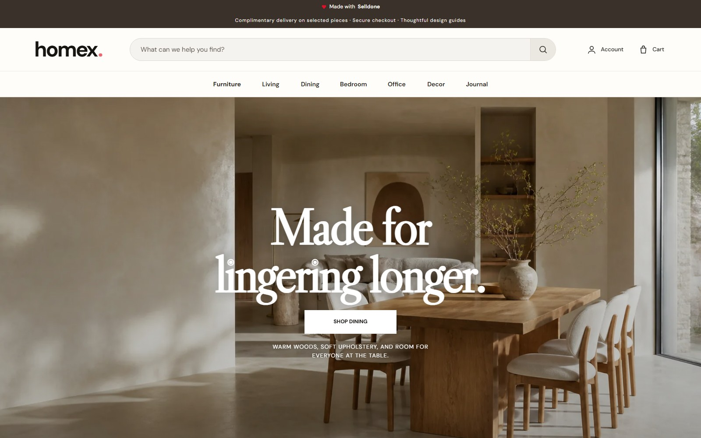
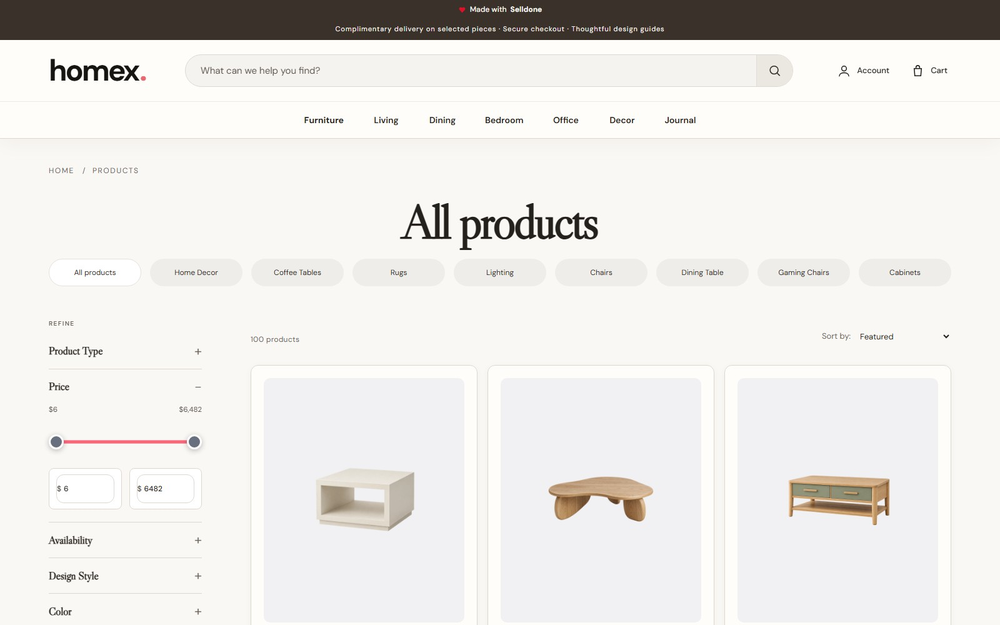
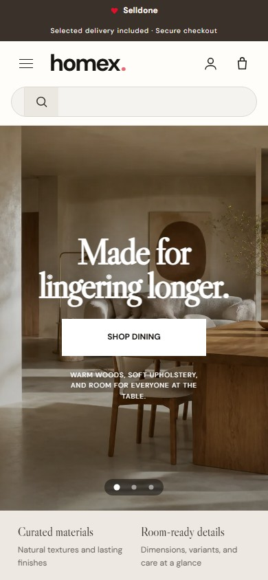

# Homex storefront

An original, responsive furniture storefront for the Selldone shop **Homex** (shop `15574`). The interface uses live Selldone catalog, product, variant, blog, account, bag, and checkout data while keeping the presentation layer in this repository.

## Preview

<p align="center">
  
</p>

| Product catalog | Furniture journal |
| --- | --- |
|  |  |

<p align="center">
  
</p>

## Catalog status

- 100 physical products across 15 furniture and home categories
- 133 variants, including color-linked gallery images
- 20 products tagged `trending`
- 20 different products tagged `Best seller`
- 6 published furniture journal articles with rectangular cover images
- Category and primary product images use transparent, optimized assets; category, listing, and product-detail stages render each subject at 70% with `object-fit: contain`

## Design

The storefront is an original Homex design built as a cohesive combination of editorial storytelling, room-led discovery, product-focused merchandising, and practical shopping interactions. The visual system, page composition, responsive behavior, and commerce experience were created specifically for this project. No third-party logo, copy, photograph, or source code is included.

The editorial campaign and journal-cover images were generated specifically for Homex and optimized for the storefront. Every file is below 500 KB.

Live Selldone XAPI is the primary catalog source. [`catalog-snapshot.js`](storefront/catalog-snapshot.js) is a versioned resilience fallback from the same shop and is used only when XAPI is unavailable or returns an application error.

## Run locally

```bash
npm install
npm run build:pages
npm run build
npm run dev:static -- --dist
```

The default development address is `http://localhost:8788`. If that port is occupied, set `STATIC_DEV_PORT` before starting the server.

## Verification

```bash
npm run check:leak
node scripts/pagecheck.mjs http://localhost:8788
node scripts/deadctl.mjs http://localhost:8788
node scripts/herocheck.mjs http://localhost:8788
node scripts/portcheck.mjs http://localhost:8788
node scripts/imgsweep.mjs http://localhost:8788
node scripts/audit-run.mjs http://localhost:8788
```

The checks cover identity leakage, distinct content routes, valid anchors, deliberately unfilled merchant facts, interactive controls, responsive hero geometry, template portability, image containment, accessibility, typography, overflow, and network failures.

The completed results and production evidence are in [`docs/acceptance-report.md`](docs/acceptance-report.md) and [`docs/pack/`](docs/pack/).

## Configuration

`shop.config.json` is the single source of truth for shop identity, hero settings, category copy, contact facts, and OAuth metadata. Run `npm run setup -- --shop-id 15574 --handle homex --name Homex --domain homex.myselldone.com` after changing shop identity fields.

Contact, address, company-registration, and opening-hours fields are intentionally not invented. The generated policy and contact pages visibly mark those merchant-owned facts as unfilled demonstration content.

## Deployment

The static build is written to `dist/`. [`wrangler.jsonc`](wrangler.jsonc) configures the `selldone-homex` Worker, its `workers.dev` address, and the custom domain [`homex.selldone.shop`](https://homex.selldone.shop/). GitHub pushes to `main` trigger Cloudflare Workers Builds. Browser login uses a shop-bound public Authorization Code + PKCE client; there is no client secret in the repository or browser bundle.

## Safety note

This is a demonstration storefront. The checkout UI does not create a real Selldone order or charge a payment method. Sample reviews are explicitly labeled. Newsletter submission is the only visitor-facing write in the static demo.
